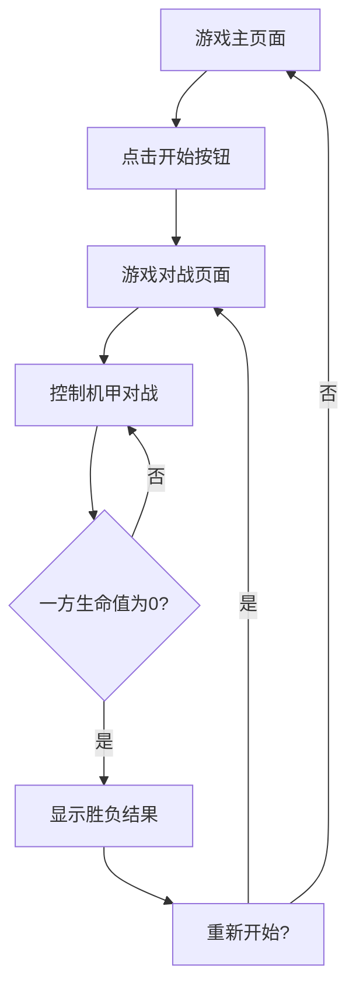

## 1. Product Overview
像素风机甲对战小游戏是一款基于浏览器的双人对战游戏，玩家可以控制机甲进行移动、攻击和防御等操作。
- 游戏面向喜欢复古像素风格和简单对战游戏的玩家，提供紧张刺激的机甲对战体验。
- 产品价值在于为用户提供一款轻量级、易上手的休闲对战游戏，适合短时间娱乐。

## 2. Core Features

### 2.1 User Roles
| Role | Registration Method | Core Permissions |
|------|---------------------|------------------|
| Player | No registration required | Control机甲进行对战 |

### 2.2 Feature Module
1. **游戏主页面**: 游戏标题、开始按钮、游戏规则说明
2. **游戏对战页面**: 机甲控制区域、游戏场景、生命值显示、胜负判定

### 2.3 Page Details
| Page Name | Module Name | Feature description |
|-----------|-------------|---------------------|
| 游戏主页面 | 游戏标题 | 显示游戏名称和像素风格的机甲图标 |
| 游戏主页面 | 开始按钮 | 点击进入游戏对战页面 |
| 游戏主页面 | 游戏规则说明 | 显示游戏操作方式和胜负条件 |
| 游戏对战页面 | 机甲控制区域 | 提供玩家1和玩家2的控制按钮（移动、攻击、防御） |
| 游戏对战页面 | 游戏场景 | 显示像素风格的战场背景和机甲角色 |
| 游戏对战页面 | 生命值显示 | 显示双方机甲的当前生命值 |
| 游戏对战页面 | 胜负判定 | 当一方生命值为0时，显示胜负结果并提供重新开始选项 |

## 3. Core Process
游戏流程：玩家进入游戏主页面 → 点击开始按钮 → 进入游戏对战页面 → 控制机甲进行对战 → 一方生命值为0时游戏结束 → 显示胜负结果 → 选择重新开始或返回主页面

## 4. User Interface Design
### 4.1 Design Style
- 主色调：深蓝色(#1a2b3c)和亮红色(#ff3333)作为机甲颜色
- 辅助色：黄色(#ffcc00)用于按钮和高亮元素
- 按钮风格：像素风格，3D效果，点击时有按压动画
- 字体：像素风格字体，如Press Start 2P
- 布局风格：居中布局，游戏场景占主要区域，控制按钮位于底部
- 图标风格：像素风格图标，简洁明了

### 4.2 Page Design Overview
| Page Name | Module Name | UI Elements |
|-----------|-------------|-------------|
| 游戏主页面 | 游戏标题 | 大标题使用像素字体，颜色为亮红色，背景为深蓝色，带有简单的闪烁动画 |
| 游戏主页面 | 开始按钮 | 黄色3D按钮，悬停时放大，点击时有按压效果 |
| 游戏主页面 | 游戏规则说明 | 白色像素字体，背景为半透明黑色，位于页面下方 |
| 游戏对战页面 | 机甲控制区域 | 左侧为玩家1控制按钮（WASD移动，F攻击，G防御），右侧为玩家2控制按钮（方向键移动，K攻击，L防御），按钮为像素风格，按下时有颜色变化 |
| 游戏对战页面 | 游戏场景 | 像素风格的战场背景，包含简单的障碍物和地面纹理，机甲角色为像素风格，带有移动和攻击动画 |
| 游戏对战页面 | 生命值显示 | 上方显示双方生命值条，红色代表玩家1，蓝色代表玩家2，生命值减少时有动画效果 |
| 游戏对战页面 | 胜负判定 | 居中显示胜负文本，使用大号像素字体，带有闪烁动画，下方有重新开始和返回主页面按钮 |

### 4.3 Responsiveness
- 设计以桌面端为主，支持1024x768及以上分辨率
- 页面元素会根据屏幕大小进行适当缩放
- 控制按钮大小适中，便于鼠标点击

### 4.4 3D Scene Guidance
- 游戏采用2D像素风格，不包含3D场景