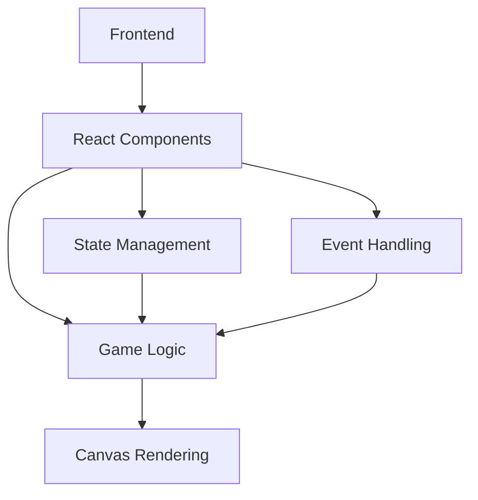
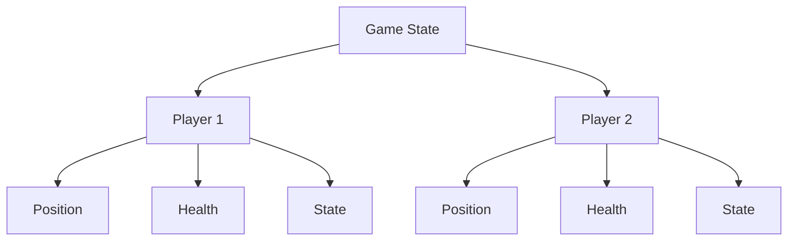

## 1. Architecture Design

## 2. Technology Description
- Frontend: React@18 + tailwindcss@3 + vite
- Initialization Tool: vite-init
- Backend: None (游戏逻辑在前端实现)
- Database: None (游戏状态在内存中管理)

## 3. Route Definitions
| Route | Purpose |
|-------|---------|
| / | 游戏主页面 |
| /game | 游戏对战页面 |

## 4. API Definitions
- 无后端API，游戏逻辑完全在前端实现

## 5. Server Architecture Diagram
- 无后端服务器架构

## 6. Data Model
### 6.1 Data Model Definition

### 6.2 Data Definition Language
- 游戏状态使用JavaScript对象在内存中管理，无需数据库
- 主要数据结构：
  - 玩家状态：位置坐标、生命值、当前状态（移动、攻击、防御）
  - 游戏状态：游戏是否开始、游戏是否结束、获胜方

## 7. Game Logic Implementation
### 7.1 Core Game Mechanics
- 移动系统：基于键盘输入控制机甲上下左右移动
- 攻击系统：玩家按下攻击键时，向对方方向发射子弹
- 防御系统：玩家按下防御键时，减少受到的伤害
- 碰撞检测：检测子弹是否击中对方机甲
- 生命值系统：机甲受到攻击时生命值减少，生命值为0时游戏结束

### 7.2 Rendering System
- 使用HTML5 Canvas进行游戏场景和角色渲染
- 实现像素风格的机甲动画和特效
- 优化渲染性能，确保游戏流畅运行

### 7.3 Control System
- 玩家1：WASD移动，F攻击，G防御
- 玩家2：方向键移动，K攻击，L防御
- 支持键盘输入和屏幕虚拟按钮操作

### 7.4 State Management
- 使用React状态管理游戏状态
- 游戏循环使用requestAnimationFrame实现
- 实时更新游戏状态和渲染画面