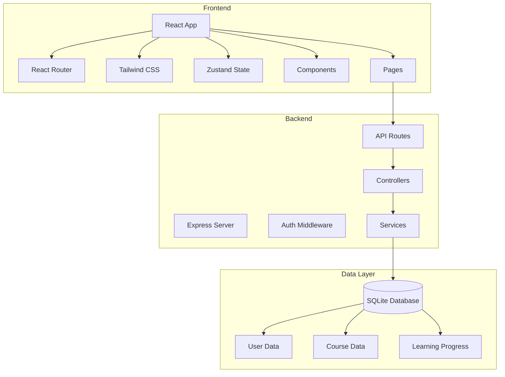
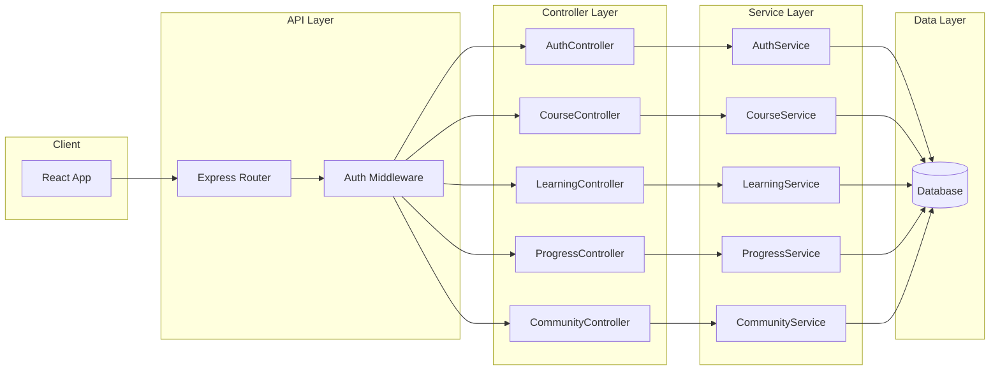
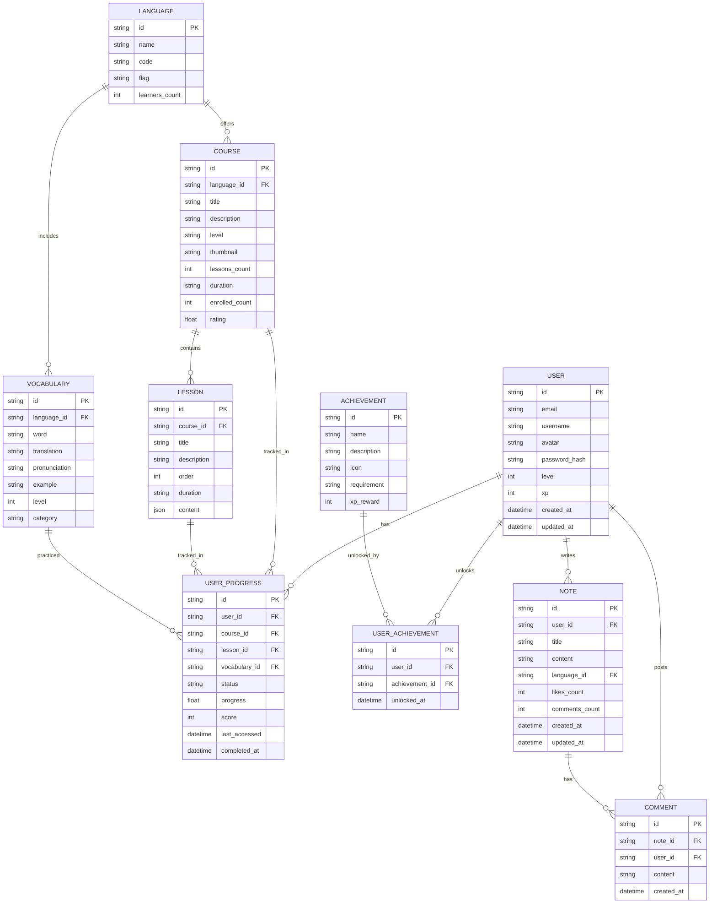

## 1. Architecture Design



## 2. Technology Description
- Frontend: React@18 + TypeScript + tailwindcss@3 + vite
- Initialization Tool: vite-init
- Backend: Express@4 + TypeScript
- Database: SQLite (开发环境) / PostgreSQL (生产环境)
- State Management: Zustand
- Routing: React Router DOM v6
- Icons: Lucide React

## 3. Route Definitions

| Route | Purpose |
|-------|---------|
| / | 首页，展示语言选择和热门课程 |
| /courses | 课程列表页面，按语言和级别筛选 |
| /courses/:id | 课程详情页面 |
| /learn | 学习中心主页面 |
| /learn/vocabulary | 单词记忆模块 |
| /learn/grammar | 语法练习模块 |
| /learn/speaking | 口语跟读模块 |
| /learn/listening | 听力训练模块 |
| /progress | 学习进度追踪页面 |
| /community | 社区交流页面 |
| /profile | 个人中心页面 |
| /login | 登录页面 |
| /register | 注册页面 |

## 4. API Definitions

### 4.1 Type Definitions

```typescript
// 用户相关
interface User {
  id: string;
  email: string;
  username: string;
  avatar?: string;
  level: number;
  xp: number;
  createdAt: string;
  updatedAt: string;
}

interface AuthResponse {
  user: User;
  token: string;
}

// 课程相关
interface Language {
  id: string;
  name: string;
  code: string;
  flag: string;
  learnersCount: number;
}

interface Course {
  id: string;
  languageId: string;
  title: string;
  description: string;
  level: 'beginner' | 'intermediate' | 'advanced';
  thumbnail?: string;
  lessonsCount: number;
  duration: string;
  enrolledCount: number;
  rating: number;
}

interface Lesson {
  id: string;
  courseId: string;
  title: string;
  description: string;
  order: number;
  duration: string;
  content: any;
}

// 学习进度相关
interface Vocabulary {
  id: string;
  languageId: string;
  word: string;
  translation: string;
  pronunciation?: string;
  example?: string;
  level: number;
  category: string;
}

interface UserProgress {
  id: string;
  userId: string;
  courseId?: string;
  lessonId?: string;
  vocabularyId?: string;
  status: 'not_started' | 'in_progress' | 'completed';
  progress: number;
  score?: number;
  lastAccessed: string;
  completedAt?: string;
}

interface Achievement {
  id: string;
  name: string;
  description: string;
  icon: string;
  requirement: string;
  xpReward: number;
}

interface UserAchievement {
  id: string;
  userId: string;
  achievementId: string;
  unlockedAt: string;
}

// 社区相关
interface Note {
  id: string;
  userId: string;
  title: string;
  content: string;
  languageId: string;
  likesCount: number;
  commentsCount: number;
  createdAt: string;
  updatedAt: string;
}

interface Comment {
  id: string;
  noteId: string;
  userId: string;
  content: string;
  createdAt: string;
}
```

### 4.2 API Endpoints

#### Auth
- POST /api/auth/register - 用户注册
- POST /api/auth/login - 用户登录
- GET /api/auth/me - 获取当前用户信息
- PUT /api/auth/profile - 更新用户资料

#### Languages & Courses
- GET /api/languages - 获取语言列表
- GET /api/courses - 获取课程列表
- GET /api/courses/:id - 获取课程详情
- GET /api/courses/:id/lessons - 获取课程课时

#### Learning
- GET /api/vocabulary - 获取单词列表
- POST /api/vocabulary/practice - 记录单词练习
- GET /api/grammar/exercises - 获取语法练习
- POST /api/grammar/exercises/:id/submit - 提交语法练习答案
- POST /api/speaking/submit - 提交口语练习
- GET /api/listening/materials - 获取听力材料

#### Progress
- GET /api/progress - 获取学习进度
- GET /api/progress/stats - 获取统计数据
- GET /api/achievements - 获取成就列表
- GET /api/achievements/user - 获取用户已解锁成就

#### Community
- GET /api/notes - 获取笔记列表
- POST /api/notes - 创建笔记
- GET /api/notes/:id - 获取笔记详情
- POST /api/notes/:id/like - 点赞笔记
- GET /api/notes/:id/comments - 获取笔记评论
- POST /api/notes/:id/comments - 发表评论

## 5. Server Architecture Diagram



## 6. Data Model

### 6.1 Data Model Definition



### 6.2 Data Definition Language

```sql
-- 用户表
CREATE TABLE users (
    id TEXT PRIMARY KEY,
    email TEXT UNIQUE NOT NULL,
    username TEXT NOT NULL,
    avatar TEXT,
    password_hash TEXT NOT NULL,
    level INTEGER DEFAULT 1,
    xp INTEGER DEFAULT 0,
    created_at DATETIME DEFAULT CURRENT_TIMESTAMP,
    updated_at DATETIME DEFAULT CURRENT_TIMESTAMP
);

-- 语言表
CREATE TABLE languages (
    id TEXT PRIMARY KEY,
    name TEXT NOT NULL,
    code TEXT UNIQUE NOT NULL,
    flag TEXT,
    learners_count INTEGER DEFAULT 0
);

-- 课程表
CREATE TABLE courses (
    id TEXT PRIMARY KEY,
    language_id TEXT NOT NULL,
    title TEXT NOT NULL,
    description TEXT,
    level TEXT NOT NULL,
    thumbnail TEXT,
    lessons_count INTEGER DEFAULT 0,
    duration TEXT,
    enrolled_count INTEGER DEFAULT 0,
    rating REAL DEFAULT 0,
    FOREIGN KEY (language_id) REFERENCES languages(id)
);

-- 课时表
CREATE TABLE lessons (
    id TEXT PRIMARY KEY,
    course_id TEXT NOT NULL,
    title TEXT NOT NULL,
    description TEXT,
    "order" INTEGER NOT NULL,
    duration TEXT,
    content TEXT,
    FOREIGN KEY (course_id) REFERENCES courses(id)
);

-- 单词表
CREATE TABLE vocabulary (
    id TEXT PRIMARY KEY,
    language_id TEXT NOT NULL,
    word TEXT NOT NULL,
    translation TEXT NOT NULL,
    pronunciation TEXT,
    example TEXT,
    level INTEGER DEFAULT 1,
    category TEXT,
    FOREIGN KEY (language_id) REFERENCES languages(id)
);

-- 用户进度表
CREATE TABLE user_progress (
    id TEXT PRIMARY KEY,
    user_id TEXT NOT NULL,
    course_id TEXT,
    lesson_id TEXT,
    vocabulary_id TEXT,
    status TEXT NOT NULL DEFAULT 'not_started',
    progress REAL DEFAULT 0,
    score INTEGER,
    last_accessed DATETIME DEFAULT CURRENT_TIMESTAMP,
    completed_at DATETIME,
    FOREIGN KEY (user_id) REFERENCES users(id),
    FOREIGN KEY (course_id) REFERENCES courses(id),
    FOREIGN KEY (lesson_id) REFERENCES lessons(id),
    FOREIGN KEY (vocabulary_id) REFERENCES vocabulary(id)
);

-- 成就表
CREATE TABLE achievements (
    id TEXT PRIMARY KEY,
    name TEXT NOT NULL,
    description TEXT,
    icon TEXT,
    requirement TEXT,
    xp_reward INTEGER DEFAULT 0
);

-- 用户成就表
CREATE TABLE user_achievements (
    id TEXT PRIMARY KEY,
    user_id TEXT NOT NULL,
    achievement_id TEXT NOT NULL,
    unlocked_at DATETIME DEFAULT CURRENT_TIMESTAMP,
    FOREIGN KEY (user_id) REFERENCES users(id),
    FOREIGN KEY (achievement_id) REFERENCES achievements(id),
    UNIQUE(user_id, achievement_id)
);

-- 笔记表
CREATE TABLE notes (
    id TEXT PRIMARY KEY,
    user_id TEXT NOT NULL,
    title TEXT NOT NULL,
    content TEXT NOT NULL,
    language_id TEXT,
    likes_count INTEGER DEFAULT 0,
    comments_count INTEGER DEFAULT 0,
    created_at DATETIME DEFAULT CURRENT_TIMESTAMP,
    updated_at DATETIME DEFAULT CURRENT_TIMESTAMP,
    FOREIGN KEY (user_id) REFERENCES users(id),
    FOREIGN KEY (language_id) REFERENCES languages(id)
);

-- 评论表
CREATE TABLE comments (
    id TEXT PRIMARY KEY,
    note_id TEXT NOT NULL,
    user_id TEXT NOT NULL,
    content TEXT NOT NULL,
    created_at DATETIME DEFAULT CURRENT_TIMESTAMP,
    FOREIGN KEY (note_id) REFERENCES notes(id),
    FOREIGN KEY (user_id) REFERENCES users(id)
);

-- 索引
CREATE INDEX idx_courses_language_id ON courses(language_id);
CREATE INDEX idx_lessons_course_id ON lessons(course_id);
CREATE INDEX idx_vocabulary_language_id ON vocabulary(language_id);
CREATE INDEX idx_user_progress_user_id ON user_progress(user_id);
CREATE INDEX idx_notes_user_id ON notes(user_id);
CREATE INDEX idx_comments_note_id ON comments(note_id);

-- 初始数据
INSERT INTO languages (id, name, code, flag, learners_count) VALUES
('lang-en', '英语', 'en', '🇬🇧', 10000),
('lang-ja', '日语', 'ja', '🇯🇵', 8000),
('lang-ko', '韩语', 'ko', '🇰🇷', 6000);

INSERT INTO achievements (id, name, description, icon, requirement, xp_reward) VALUES
('ach-first-lesson', '初学者', '完成第一个课时', '🎯', 'Complete first lesson', 50),
('ach-week-streak', '坚持一周', '连续学习7天', '🔥', '7 day streak', 200),
('ach-100-words', '词汇达人', '掌握100个单词', '📚', 'Learn 100 words', 300),
('ach-first-note', '分享者', '发布第一篇笔记', '✍️', 'Write first note', 100);
```
