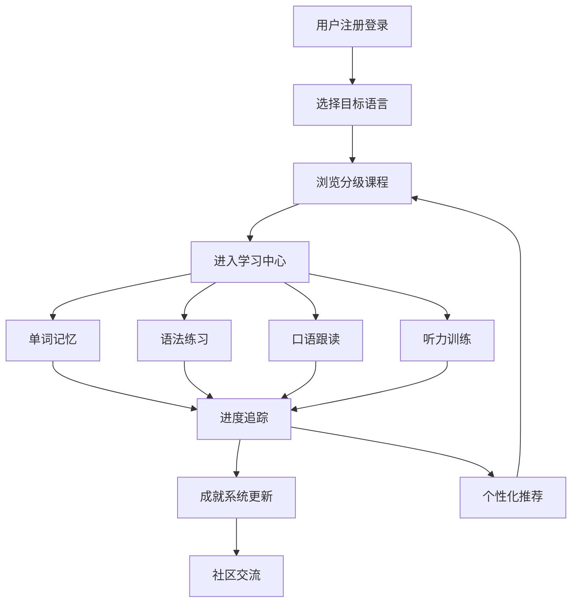

## 1. Product Overview
沉浸式多语种在线学习平台，提供英语、日语、韩语等主流语言的系统化学 习方案。
- 解决传统语言学习缺乏互动性、进度追踪困难的问题，面向各年龄段语言学习者
- 打造智能、有趣、高效的语言学习体验，提升全球语言学习者的学习效率

## 2. Core Features

### 2.1 User Roles
| Role | Registration Method | Core Permissions |
|------|---------------------|------------------|
| 普通学习者 | 邮箱/手机号注册 | 浏览课程、参与学习、记录进度、社区交流 |
| 管理员 | 后台邀请 | 课程管理、用户管理、内容审核 |

### 2.2 Feature Module
1. **首页**：英雄区、语言选择、热门课程推荐
2. **课程页面**：分级课程体系、课程详情、课程大纲
3. **学习中心**：单词记忆、语法练习、口语跟读、听力训练
4. **进度追踪**：学习数据可视化、成就系统、个性化推荐
5. **社区交流**：学习笔记分享、话题讨论、用户互动
6. **个人中心**：用户资料、学习设置、账号管理

### 2.3 Page Details
| Page Name | Module Name | Feature description |
|-----------|-------------|---------------------|
| 首页 | 英雄区 | 动态背景、标语展示、快速开始按钮 |
| 首页 | 语言选择 | 英语、日语、韩语等语言卡片，点击进入对应课程 |
| 首页 | 热门课程 | 精选课程展示，包含课程封面、标题、难度、学习人数 |
| 课程页面 | 课程列表 | 按级别分类的课程网格，支持筛选和搜索 |
| 课程页面 | 课程详情 | 课程介绍、学习目标、课程大纲、学习进度 |
| 学习中心 | 单词记忆 | 闪卡模式、拼写练习、词义匹配、进度记录 |
| 学习中心 | 语法练习 | 选择题、填空题、错题本、知识点解析 |
| 学习中心 | 口语跟读 | 音频播放、录音对比、发音评分 |
| 学习中心 | 听力训练 | 听力材料播放、选择题、填空题、速度调节 |
| 进度追踪 | 数据看板 | 学习时长、单词掌握、课程完成率等图表展示 |
| 进度追踪 | 成就系统 | 成就徽章、等级体系、解锁奖励 |
| 社区交流 | 笔记分享 | 学习笔记发布、点赞评论、收藏功能 |
| 社区交流 | 话题讨论 | 热门话题、用户发帖、回复互动 |
| 个人中心 | 用户资料 | 头像、昵称、学习目标设置 |
| 个人中心 | 账号管理 | 登录注册、密码修改、账号设置 |

## 3. Core Process
用户注册登录后，选择目标语言，进入分级课程体系。通过互动式学习模块进行单词记忆、语法练习、口语跟读和听力训练，系统实时追踪学习进度并更新成就数据。用户可以在社区分享学习笔记，参与话题讨论，获得个性化学习路径推荐。

## 4. User Interface Design

### 4.1 Design Style
- 主色调：蓝色系 (#3B82F6) 代表知识与专业，辅助色：橙色 (#F59E0B) 代表活力与动力
- 按钮风格：圆角矩形，带有微妙的阴影和悬停动画效果
- 字体：现代无衬线字体，标题使用较粗字重，正文使用适中字重保证可读性
- 布局风格：卡片式布局，模块化设计，充足的留白营造清爽的学习环境
- 图标风格：简约线条图标，搭配柔和的色彩填充

### 4.2 Page Design Overview
| Page Name | Module Name | UI Elements |
|-----------|-------------|-------------|
| 首页 | 英雄区 | 渐变背景、大号标题、副标题、主要CTA按钮、次要链接 |
| 首页 | 语言选择 | 语言卡片网格，包含语言名称、国旗图标、学习人数统计 |
| 首页 | 热门课程 | 课程卡片轮播，包含封面图、课程标题、难度标签、学习进度条 |
| 学习中心 | 单词记忆 | 闪卡动画、卡片翻转效果、进度指示、控制按钮组 |
| 学习中心 | 语法练习 | 题目卡片、选项按钮、答题反馈动画、知识点解释面板 |
| 进度追踪 | 数据看板 | 统计卡片、柱状图、折线图、进度圆环、成就徽章展示 |
| 社区交流 | 笔记分享 | 笔记卡片瀑布流、用户头像、时间戳、互动统计 |

### 4.3 Responsiveness
采用桌面优先设计，同时完美适配平板和移动设备。响应式断点设置为：
- 桌面端：1024px 及以上
- 平板端：768px - 1023px
- 移动端：767px 及以下
针对触摸设备优化按钮尺寸和交互区域，确保流畅的移动端学习体验。
